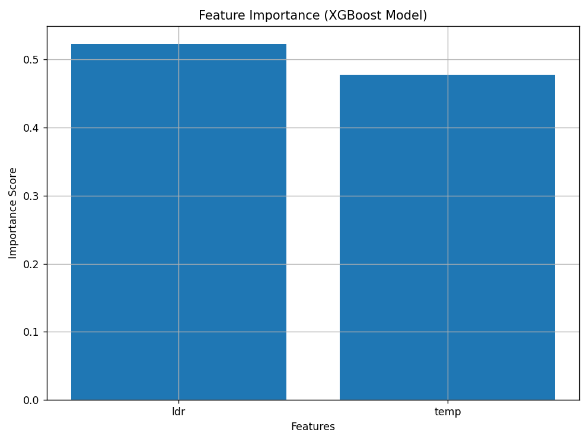

# Intelligent Light Intensity Measurement System with Auto-Calibration Using Machine Learning

## Team Name
LuxSense

## Team Members
- Gaurav Yadav
- Radheshyam E.P

## Guide
Dr. A.N. Gnana Jeevan

## Project Overview
This project presents an ESP32-based intelligent light intensity measurement system that improves the accuracy of a low-cost LDR sensor using machine learning-based calibration. The system uses TSL2561 as the reference lux sensor, BH1750 as a secondary sensor for comparison and validation, and DHT22 for temperature monitoring. The calibrated lux value is displayed on an OLED display and used for automatic lighting control in a smart home prototype.

## Problem Statement
Low-cost light sensors such as LDRs are inexpensive and widely available, but their readings are often inaccurate, nonlinear, and affected by environmental conditions. This makes them unreliable for precise light measurement and practical automation. The goal of this project is to improve the usability of a low-cost sensor by calibrating it against a reliable reference sensor using machine learning.

## Objectives
- To measure indoor light intensity using low-cost sensors
- To improve LDR accuracy through machine learning-based auto-calibration
- To use TSL2561 as the reference lux sensor
- To use BH1750 as a secondary sensor for comparison and validation
- To monitor temperature using DHT22
- To display real-time readings on OLED
- To control LED lighting automatically based on calibrated lux
- To demonstrate a smart home lighting prototype

## Proposed Solution
The proposed system collects raw light intensity data from an LDR and temperature data from DHT22. TSL2561 is used as the ground-truth reference lux sensor during dataset generation and model training. BH1750 is used as a secondary digital light sensor for comparison and validation. A machine learning model is trained in Python to predict calibrated lux values from low-cost sensor inputs. The final system is implemented on ESP32 and demonstrated through an automatic lighting control prototype.

## Hardware Components
- ESP32
- LDR sensor
- TSL2561 light sensor
- BH1750 light sensor
- DHT22 temperature sensor
- OLED SSD1306 display
- IRLZ44N MOSFET
- 12V LED strip
- Breadboard
- Jumper wires
- Cardboard house model

## Software Used
- Arduino IDE
- Python
- pandas
- numpy
- matplotlib
- scikit-learn
- xgboost

## Setup Instructions
### Hardware Setup
1. Connect the LDR, DHT22, TSL2561, BH1750, and OLED display to the ESP32.
2. Connect the IRLZ44N MOSFET to the ESP32 output pin for LED strip control.
3. Connect the 12V LED strip through the MOSFET.
4. Ensure that the ESP32 ground and external power supply ground are common.

### Software Requirements
- Arduino IDE
- Python 3.x
- Required Python libraries: pandas, numpy, matplotlib, scikit-learn, xgboost
- Required Arduino libraries for ESP32, OLED, DHT22, BH1750, and TSL2561

### Running the Project
1. Upload `firmware/esp32_code.ino` to the ESP32 using Arduino IDE.
2. Use the sensor setup to collect light and temperature readings.
3. Run `ml_model/train_model.py` in Python to train or review the calibration model.
4. Refer to `data/lux_data.csv` for the dataset used in training.
5. View graphs and presentation files in the `docs/` folder.

### Output
- OLED displays live sensor readings and calibrated lux
- LED turns ON/OFF based on calibrated lux threshold

## System Workflow
1. LDR senses raw light intensity
2. DHT22 measures temperature
3. TSL2561 provides reference lux values
4. BH1750 provides secondary comparison values
5. Sensor data is collected to create the dataset
6. A machine learning model is trained using Python
7. The model predicts calibrated lux values
8. OLED displays live readings and calibrated lux
9. LED turns ON or OFF based on calibrated lux threshold

## Dataset
The dataset used for model training and validation is available in the `data/` folder as `lux_data.csv`.

### Dataset Parameters
- `time`
- `ldr`
- `temp`
- `tsl2561`
- `bh1750`

## Machine Learning Model
- **Model used:** XGBoost Regressor
- **Input features:** LDR, Temperature
- **Target:** TSL2561 lux
- **Secondary comparison:** BH1750

The machine learning model was trained offline in Python. A simplified deployment logic was later used in the embedded system for real-time calibrated lux prediction and automatic LED control.

## Results
The system showed strong calibration performance for indoor lighting conditions.

- **MAE:** 12
- **R2 Score:** 0.97

The result graphs are available in the `docs/` folder:
- `result_graph_1.png`
- `result_graph_2.png`
- `comparison_graph.png`

## Graphical Results

### Result Graph 1

### Result Graph 2

### Comparison Graph

## Project Prototype

## Repository Structure
- `hardware/` : hardware components list and connections
- `firmware/` : ESP32 Arduino code
- `ml_model/` : machine learning training code and model results
- `data/` : dataset used for training and validation
- `docs/` : project summary, graphs, prototype image, and presentation

## Applications
- Smart home lighting
- Indoor automation systems
- Low-cost light monitoring
- Energy-efficient lighting control
- Future extension to street lighting systems

## Future Scope
- IoT dashboard integration
- Cloud data logging
- Mobile app monitoring
- Improved embedded ML deployment
- Extension to larger smart lighting systems

## Project Files
- ESP32 code is available in `firmware/esp32_code.ino`
- ML training code is available in `ml_model/train_model.py`
- Model performance details are available in `ml_model/model_results.md`
- Dataset is available in `data/lux_data.csv`
- Final project presentation is available in `docs/expo_presentation.pptx`

## Point of Contact
**Gaurav Yadav**  
Team LuxSense  
SRM Institute of Science and Technology, Tiruchirappalli  
For project-related queries, please contact through this GitHub repository.

## Conclusion
This project demonstrates that a low-cost LDR sensor can be made more reliable through machine learning-based calibration. By using TSL2561 as a reference sensor and BH1750 as a secondary comparison sensor, the system improves light measurement accuracy and applies it to automatic lighting control. The final prototype proves that low-cost sensing combined with machine learning can be used for practical indoor smart lighting applications.
